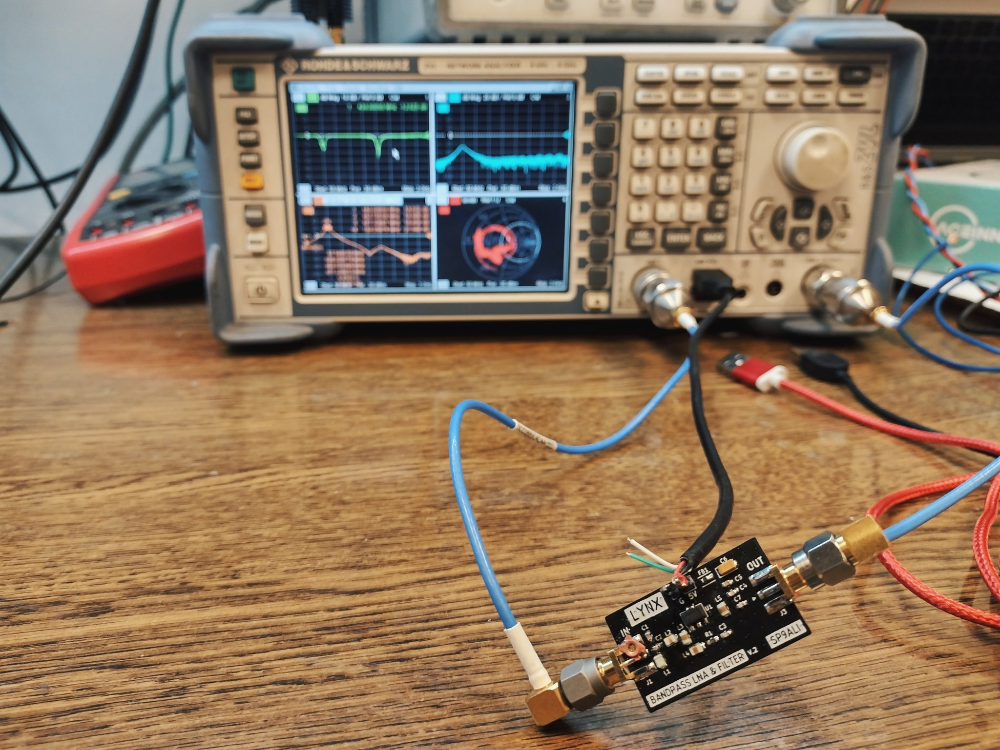

# Lynx - LNA with filter for 400-440 MHz

### ◾ About the project

**Lynx** is an LNA with a filter with two SMA connectors. It was designed for 400-400 MHz (UHF satellite amateur band) by default, but by changing components' values it can be tuned to every chosen frequency. It contains the amplifier (with PGA-103+ as the main component) and the bandpass Chelbyshev filter (shunt first, 2nd order).
 
Gerber files for version 2.0 of Lynx is available [in the releases section](https://github.com/alicjamusial/argon/releases/tag/argon-1.0). 

The board was designed using [KiCad](https://kicad.org/) (version: `5.99.0-7233-g6a28d6af27`).

### ◾ Usage
- **Very important!** Order PCB with **0.6mm** thickness and 1oz copper weight.
- Lynx requires connection of 5V and GND.
- It would be best to connect Lynx as close to the antenna as possible.

### ◾ Parameters
According to the measurements, in range 400-440 MHz Lynx should provide gain around 16-20 dB.

### ◾ License
Lynx is available on Creative Commons Attribution Share Alike 4.0 International license (more in [license file](LICENSE.txt)). You are free to use it, modify it and produce as many of your own boards as you need :)

